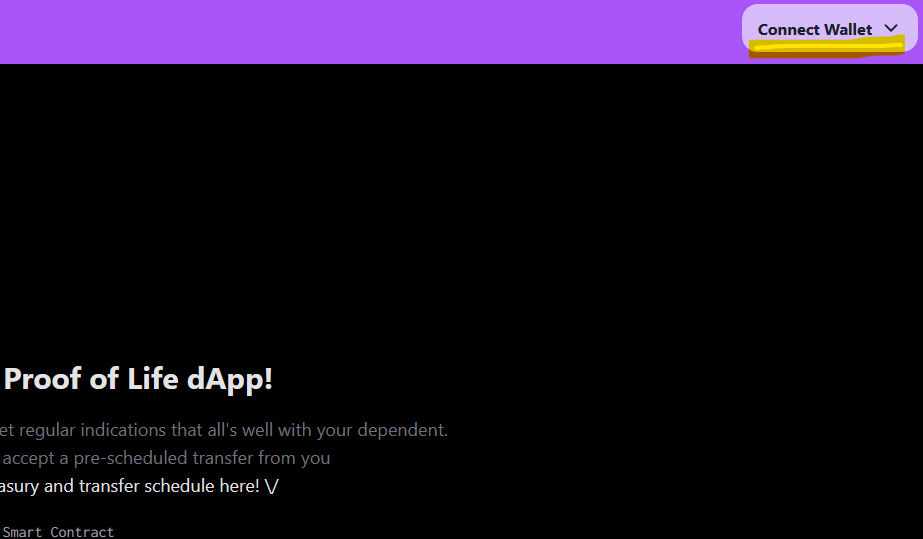
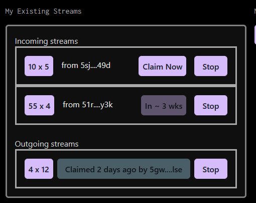

# Proof of Life Intro & How-to

Thank you for your interest in **Proof of Life**.
The fun yet practial _Proof of Life_ dApp is designed for parents &
guardians of late teen / early 20s children that live away from home.
These young adults may not yet be fully financially independent (e.g.
in 3rd level education or travelling) so they may require money transfers
at different periods.

Many parents & guardians love hearing from their children when they're away,
yet the children are busy and otherwise independent. So they may not contact
home as often as parents would like!
 
This is where Proof of Life shines. It allows parents & guardians to set up a
series of regular payments to a dependent. When the dependent claims the
payment, the adult sees that it was claimed, and so knows that the child is
alive and well!

_Proof of Life_ makes use of WASM smart contracts by _Zink_ for interative value transfer.

## Getting Started

Get started by **opening the dApp**.

### Connect

1. Connect your wallet on the top right:

You can see your starting account balance of native tokens immediately to the
left of the wallet.

In the main pane, you can see your treasury balance. This will have a number
if you've previously deposited any funds to treasury, otherwise it'll be blank:

### Deposit

Deposit value your treasury for transfer. The max you can deposit cannot exceed
your on-chain token balance, at the top right (See connect step above):

You will see that your treasury balance
had changed:

### Create a Stream

Then you can create a stream by clicking on create a stream:

- Set a payment amount, time between payments, number of iterations and recipient address
- Add the stream (Note that this is a mockup at present)

This is added to your list of outgoing streams. When a payment is claimed by the
recipient, the dApp shows you that a claim was made.

You can create multiple varying streams, even for the same recipient.

### Existing Streams

This is a view of how existing streams, incoming and outgoing, are shown:

### Incoming Streams.

If you are the lucky recipient of one or more streams, once connected, you can
see the list in your incoming Streams.

- For any streams where a payment iteration is now claimable, you can click claim.
- Any stream not currently claimable shows the approximate duration until
  the next iteration can be claimed.
- Claiming notifies the payment stream creator that you have claimed.
